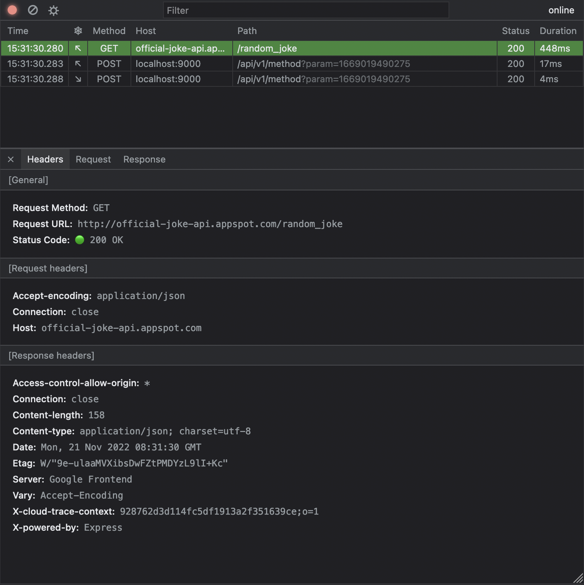

# @anissoft/echo 

### Easy-to-use network intercepting tool for nodeJS



## Installation

```sh
npm --registry=https://registry.npmjs.org i @anissoft/echo@latest # add --save-dev if you have no intends to include it into production build, or --no-save if you want to use just debugging interface
```

## Usage
### UI for requests analysis
Import `startUI` command from package and execute it in the very beginning of your program. It will start the static server and provide the exact link to the web interface in terminal.

```js
require('@anissoft/echo').startUI({ port: 4900 });
// or just
require('@anissoft/echo').start();
```

> The best way to do so - is to place the above code in a separate file (e.g. debug.js) and import it in your application's entry point (e.g. index.js).

> You may skip passing a port attribute, but it is easier to use the same port between restarts, so you dont need to search new url in logs every time.

### Custom onRequest listeners (experimental)

You can capture all requests (incoming and outgoing) and run your custom callbacks for the next events:

| Event name                           | Description                   | Event content                                                                                                      |
|--------------------------------------|-------------------------------|--------------------------------------------------------------------------------------------------------------------|
| `RequestEvent.incomingRequestStart`  | received incoming request     | method, url, timeStart, requestHeaders, request                                                                    |
| `RequestEvent.outgoingRequestStart`  | sent request                  | method, url, timeStart, requestHeaders, request                                                                    |
| `RequestEvent.incomingRequestFinish` | sent response for request     | method, url, timeStart, requestHeaders, request, <br>statusCode, statusMessage, timeEnd, responseHeaders, response |
| `RequestEvent.outgoingRequestFinish` | received response for request | method, url, timeStart, requestHeaders, request, <br>statusCode, statusMessage, timeEnd, responseHeaders, response |

```js
const { subscribe, RequestEvent } = require('@anissoft/echo');

const unsubscribes = [
  subscribe(
    RequestEvent.incomingRequestStart, 
    event => console.log('incoming-start', event),
  ),
  subscribe(
    RequestEvent.incomingRequestFinish, 
    event => console.log('incoming-end', event),
  ),
  subscribe(
    RequestEvent.outgoingRequestStart, 
    event => console.log('outgoing-start', event),
  ),
  subscribe(
    RequestEvent.outgoingRequestFinish, 
    event => console.log('outgoing-end', event)
  ),
];
```

> Make sure not to expose any sensetive data from events \
> eg. personal data, API-keys or authorizations headers
